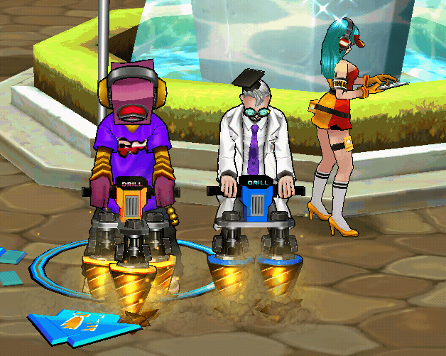
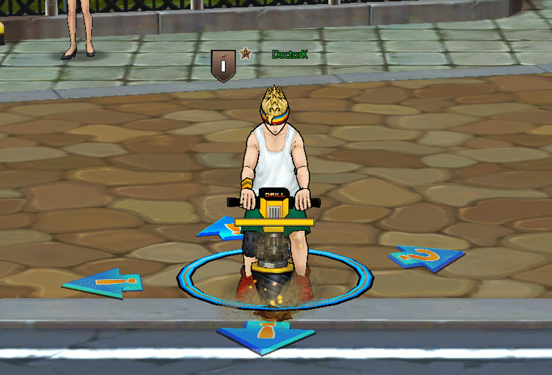
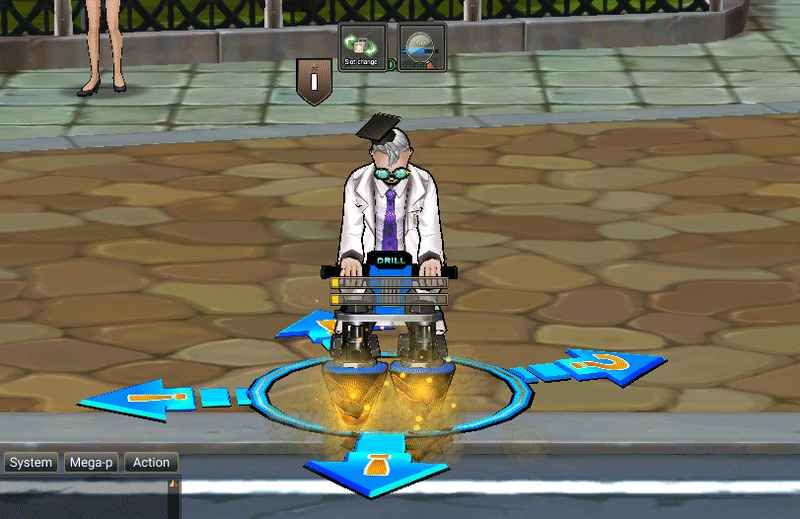
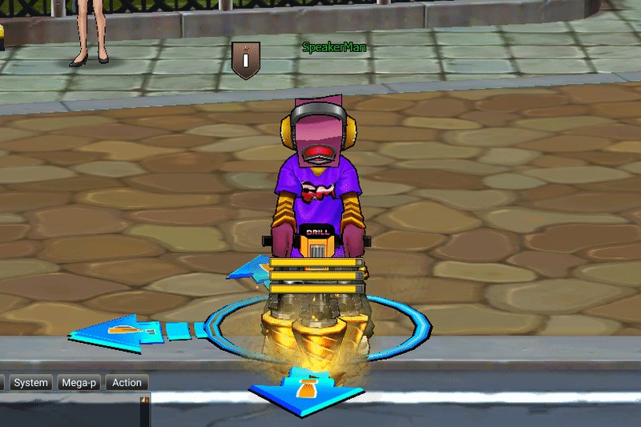
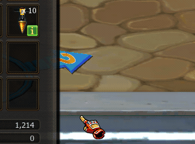

# ⛏️ Drilling System

### Overview

<figure><figcaption></figcaption></figure>

**Drilling System** ในเกม **Zone4** เป็นระบบกิจกรรมพิเศษที่เปิดโอกาสให้ผู้เล่นสามารถ **ขุดหารางวัล** \
**(Dig for Rewards)** จากจุดขุดที่กำหนดไว้ภายในพื้นที่ของเกม ระบบนี้ถูกออกแบบมาเพื่อเพิ่มกิจกรรมเสริมให้กับผู้เล่นนอกเหนือจากการต่อสู้ และมอบโอกาสในการได้รับไอเทมพิเศษหรือรางวัลต่าง ๆ ผ่านกลไกแบบสุ่ม

การขุดจะใช้ **เครื่องมือขุด (Drill Tool)** ซึ่งผู้เล่นสามารถนำมาใช้เพื่อสุ่มรับไอเทมจากระบบรางวัลที่กำหนดไว้

ระบบ Drilling เป็นกิจกรรมที่เน้น

* การสุ่มรางวัล (Random Reward)
* การสะสมไอเทม
* การมีส่วนร่วมในกิจกรรมของเกม

***

## How the Drilling System Works

### 1. Obtaining Drill Tools

ก่อนที่ผู้เล่นจะสามารถทำการขุดได้ จำเป็นต้องมี **Drill Tool** ซึ่งเป็นไอเทมที่ใช้สำหรับการขุด

### Drill Tool Types

<figure><figcaption></figcaption></figure>

<figure><figcaption></figcaption></figure>

<figure><figcaption></figcaption></figure>

<figure><figcaption></figcaption></figure>

<figure><figcaption></figcaption></figure>

<figure><figcaption></figcaption></figure>

ผู้เล่นสามารถได้รับ Drill Tool จากหลายช่องทาง เช่น

* ซื้อจาก DE Shop ภายในเกม
* รางวัลจากกิจกรรม
* รางวัลจากภารกิจพิเศษ

***

### 2. Accessing the Drilling Interface

เมื่อผู้เล่นมี Drill Tool แล้ว สามารถ ใช้งาน และ เข้าสู่ระบบ Drilling ภายในเกม

ระบบจะแสดงหน้าจอที่แสดง

<figure><figcaption></figcaption></figure>

* จำนวน เวลา Drill Tool ที่ผู้เล่นมีเหลืออยู่

<figure><figcaption></figcaption></figure>

* รายการรางวัลที่มีโอกาสได้รับ

<figure><figcaption></figcaption></figure>

* ปุ่มเริ่มต้นการขุด หรือ การกดปุ่ม CTRL

***

### 3. Performing the Drill

เมื่อผู้เล่นเลือกทำการขุด

ระบบจะ

1. ใช้ Drill Tool จำนวน 1 ชิ้น
2. ทำการสุ่มรางวัลจาก Reward Pool
3. แสดงผลลัพธ์ของรางวัลที่ได้รับ

รางวัลจะถูกส่งเข้าไปยัง

* Inventory ของผู้เล่น
* Mail System (ในกรณีที่ Inventory เต็ม)

***

## Reward Pool

ระบบ Drilling จะมี **Reward Pool** ซึ่งประกอบไปด้วยไอเทมหลายประเภท โดยมีโอกาสดรอปที่แตกต่างกัน
