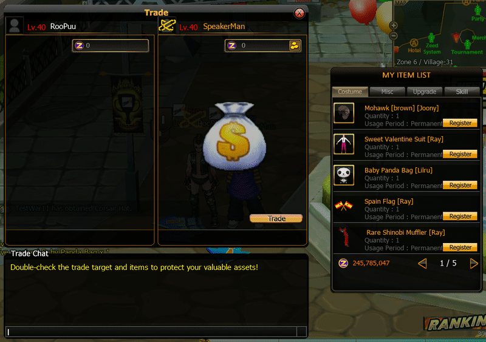
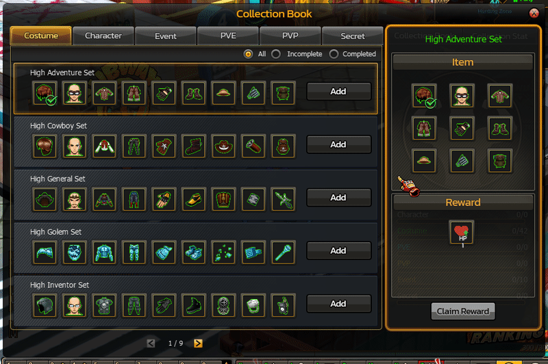
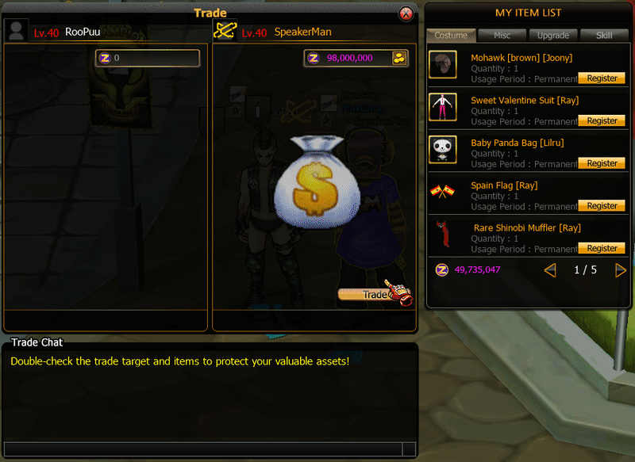

# Exchange System

### Overview

**P2P Exchange System** เป็นระบบที่อนุญาตให้ผู้เล่นสองคนทำการ **แลกเปลี่ยนไอเทมและเงิน (Z)** ระหว่างกันโดยตรงภายในเกม

<figure><figcaption></figcaption></figure>

## Trade UI Components

จากภาพระบบมีส่วนประกอบหลักดังนี้

### Trade Window

องค์ประกอบ

| Component           | Description         |
| ------------------- | ------------------- |
| Player Info         | แสดงชื่อและเลเวล    |
| ZEN                 | ใส่เงิน ZEN         |
| Item Slot           | ใส่ไอเทม            |
| Trade Button        | ยืนยันการแลกเปลี่ยน |
| Trade Cancel Button | ยกเลิกการแลกเปลี่ยน |

### Item Trading

<figure><figcaption></figcaption></figure>

ผู้เล่นสามารถ Register ไอเทมจาก

```
MY ITEM LIST
```

ไปยัง

```
Trade Slot
```

<figure><figcaption></figcaption></figure>

### Zen Trading

<figure><figcaption></figcaption></figure>

ผู้เล่นสามารถ กรอกจำนวน Zen

```
MY Zen (Z)
```

ไปยัง

```
(Z) Zen Slot
```

<figure><figcaption></figcaption></figure>
