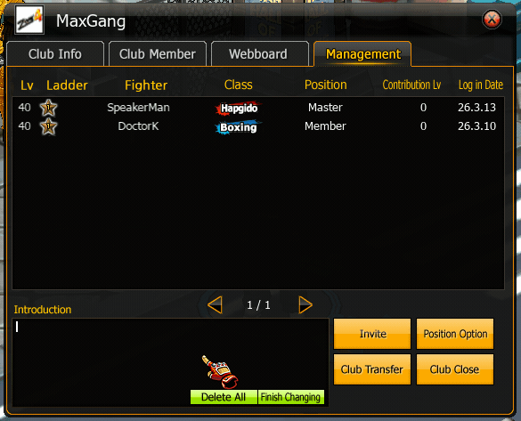

# 🤝 Gang System

## 1. หน้าหลักของ Gang (Gang Info)

<figure><figcaption></figcaption></figure>

จากภาพ เป็นหน้าข้อมูล Gang หลัก

#### ข้อมูลที่แสดง

**หัวหน้า Gang**

* ชื่อผู้สร้าง Gang

**สมาชิก Gang**

* จำนวนสมาชิก
* เช่น **4 / 20**
* หมายถึงมีสมาชิก 4 คน จากสูงสุด 20 คน

**เลเวล Gang**

* Level ของ Gang
* เพิ่มจาก EXP ของ Gang

**Gang Buff**

* เลเวล Buff ของ Gang

**ประวัติ Gang**

* ประวัติการต่อสู้ / กิจกรรม

**ตำแหน่ง Gang**

* Rank ของ Gang ในระบบ

***

#### ส่วนที่สามารถแก้ไขได้

<figure><figcaption></figcaption></figure>

**คำแนะนำ Gang**

* รายละเอียดหรือคำอธิบาย Gang

***

#### ปุ่มสำคัญ

**รายชื่อ Gang**

* ดูสมาชิกทั้งหมด

**ออกจาก Gang**

* ใช้สำหรับออกจาก Gang

***

## 3. ระบบสมาชิก Gang (Gang Member)

<figure><figcaption></figcaption></figure>

จากภาพที่สาม เป็นหน้ารายชื่อสมาชิก

#### ข้อมูลสมาชิกที่แสดง

| Column  | ความหมาย        |
| ------- | --------------- |
| Lv      | เลเวลตัวละคร    |
| Ladder  | Rank PvP        |
| Fighter | ชื่อตัวละคร     |
| อาชีพ   | Style การต่อสู้ |
| ระดับ   | ตำแหน่งใน Gang  |
| บันทึก  | วันที่เข้าร่วม  |

***

#### ตัวอย่างตำแหน่งใน Gang

**Master**

* หัวหน้า Gang
* จัดการทุกอย่างได้

**SemiMaster**

* รองหัวหน้า

**Member**

* สมาชิกทั่วไป

***

## 4. ระบบตำแหน่งใน Gang

ตำแหน่งหลักใน Gang

| Rank       | สิทธิ์              |
| ---------- | ------------------- |
| Master     | จัดการ Gang ทั้งหมด |
| SemiMaster | ช่วยจัดการ Gang     |
| Member     | สมาชิกทั่วไป        |

Master สามารถ

* เชิญสมาชิก
* เตะสมาชิก
* เปลี่ยนตำแหน่ง
* แก้ไขข้อมูล Gang

***

## 5. ระบบ Gang Level

Gang จะมี Level ของตัวเอง

เพิ่มจาก

* Gang PvP

ตัวอย่าง

```
Lv.1 → Lv.2 → Lv.3 ...
```

เลเวลสูงขึ้นจะ

* เพิ่มจำนวนสมาชิก

***

## 6. ระบบ Gang PvP

ในหน้าต่างจะมี

**บันทึก Gang PvP**

ใช้เก็บข้อมูล

* การต่อสู้ Gang
* ผลการแข่งขัน

ตัวอย่าง

```
Win / Lose
Score
Opponent
```

***

## 7. ระบบกระดานข่าว (Gang Board)

ใช้สำหรับ

* แจ้งข่าวสมาชิก
* นัดกิจกรรม
* ประกาศ Gang

***

## 8. ระบบจัดการ Gang

หน้าจัดการจะมี

* Invite สมาชิก
* Kick สมาชิก
* Promote
* Change Master

***

## 10. จำนวนสมาชิกสูงสุด

เริ่มต้น

```
20 คน
```

สามารถเพิ่มได้จาก

* Item
