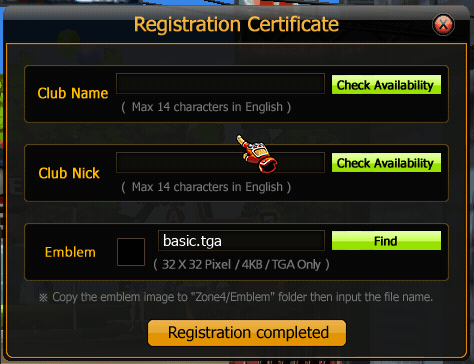

# Gang Create

## 1. Gang Create(Registration Certificate)

เมื่อผู้เล่นต้องการสร้าง Gang จะต้องเปิดหน้าสร้าง Gang ตามภาพแรก

<figure><figcaption></figcaption></figure>

ช่องที่ต้องกรอก

**1️⃣ Club Name**

* ชื่อ Gang หลัก
* ใช้ภาษาอังกฤษเท่านั้น
* จำกัด **ไม่เกิน 14 ตัวอักษร**

**2️⃣ Club Nick**

* ชื่อย่อ Gang (Tag)
* ใช้แสดงหน้าชื่อตัวละคร
* จำกัด **ไม่เกิน 14 ตัวอักษร**

**3️⃣ Emblem**

* โลโก้ของ Gang
* ไฟล์ต้องเป็น **.TGA**
* ขนาด **32x32 Pixel**
* ขนาดไฟล์ไม่เกิน **4KB**

วิธีใช้ Emblem

1. นำไฟล์ไปไว้ในโฟลเดอร์

```
Zone4/Emblem
```

2. ใส่ชื่อไฟล์ เช่น

```
basic.tga
```

เมื่อกรอกครบแล้วกด

**Registration Completed**

Gang จะถูกสร้างทันที และผู้สร้างจะเป็น **หัวหน้า Gang (Master)**
