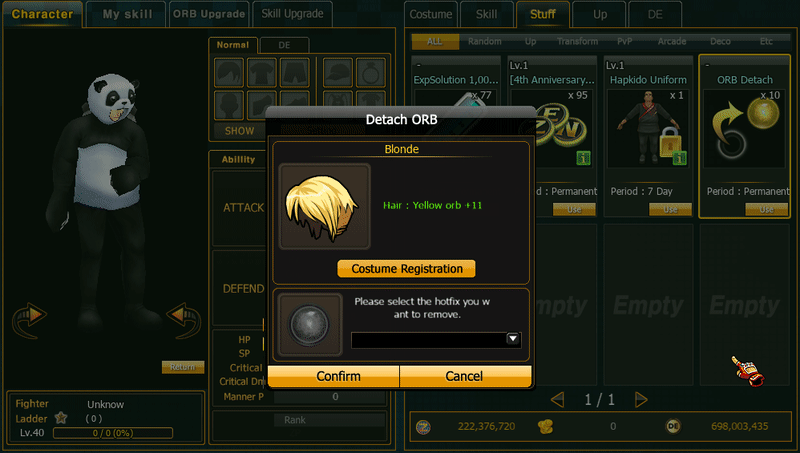

# ORB Deatch

### Overview

**ORB Detach System** เป็นระบบที่อนุญาตให้ผู้เล่น **ถอดลูกแก้ว (ORB)** ออกจาก Costume หรือ Equipment โดยไม่ทำให้ ORB สูญหาย

โดยผู้เล่นต้องใช้ไอเทมพิเศษ

<figure><figcaption></figcaption></figure>

## 1. Usage Rule

กฎการใช้งาน

```
1 ORB Detach = Remove 1 ORB
```

ตัวอย่าง

| ORB   | Required Item |
| ----- | ------------- |
| 1 Orb | 1 Item        |

## ORB Detach Flow

ขั้นตอนการถอด ORB

#### Step 1

ผู้เล่นเปิด My Room  .png>)

```
My Room
```

<figure><figcaption></figcaption></figure>

Use Item > ORB Detach

```
ORB Detach Item
```

***

#### Step 3

<figure><figcaption></figcaption></figure>

Confirm Item ที่ต้องการใช้งาน

```
Unsocket ORB
```

***

#### Result

<figure><figcaption></figcaption></figure>

<figure><figcaption></figcaption></figure>

ผลลัพธ์

```
ORB → Inventory
Item Slot → Empty
```
