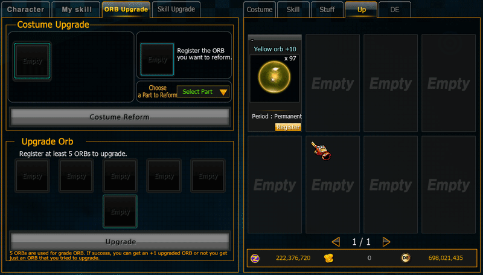

# ⚪ ORB System

<figure><figcaption></figcaption></figure>

### Overview

**ORB System** เป็นระบบ **Enhancement / Socket System** ของเกม Zone4 ที่อนุญาตให้ผู้เล่นใส่ **ลูกแก้ว (ORB)** ลงในอุปกรณ์ของตัวละครเพื่อเพิ่ม **Stat Bonus**

คุณสมบัติหลักของระบบ

* ใส่ ORB ลงใน Costume
* มีระดับ ORB ตั้งแต่ **+1 ถึง +20**
* ORB สามารถ **Upgrade**
* เพิ่ม Stat ให้ตัวละคร

ระบบนี้เป็น **Core Progression System** ของเกม

## Equipment Slot Structure

ชุดตัวละครสามารถติด ORB ได้ทั้งหมด

```
9 Slots
```

ตัวอย่าง Slot

| Slot   | Description |
| ------ | ----------- |
| Hair   | ทรงผม       |
| Face   | หน้า        |
| Top    | เสื้อ       |
| Bottom | กางเกง      |
| Shoes  | รองเท้า     |
| Gloves | ถุงมือ      |
| Back   | หลัง        |
| Hat    | หมวก        |
| Ring   | แหวน        |

## ORB Levels

ORB มีระดับ

```
+1 → +20
```

ระดับยิ่งสูง

* Stat เพิ่มขึ้น
* ความหายากเพิ่มขึ้น
* มูลค่าเพิ่มขึ้น

***

## ORB Types

ORB อาจมีหลายประเภท เช่น

<table><thead><tr><th width="95">Colors</th><th>ORB Types</th><th>Stats Effect</th></tr></thead><tbody><tr><td>🟠</td><td>Orange ORB</td><td>Hit Attack</td></tr><tr><td>🔵</td><td>Skyblue ORB</td><td>Grip Attack</td></tr><tr><td>🟢</td><td>Green ORB</td><td>Hit Defense</td></tr><tr><td>🟣</td><td>Purple ORB</td><td>Grip Defense</td></tr><tr><td>🟡</td><td>Yellow ORB</td><td>Critical</td></tr><tr><td>🔴</td><td>Red ORB</td><td>HP</td></tr><tr><td>🔵</td><td>Blue ORB</td><td>SP</td></tr><tr><td>⚪</td><td>White ORB</td><td>Critical Damage</td></tr><tr><td>🟣</td><td>Violet ORB</td><td>Team Attack</td></tr></tbody></table>

ตัวอย่าง

<figure><figcaption></figcaption></figure>

```
Yellow Orb +10
```

***

## ORB Upgrade System

<figure><figcaption></figcaption></figure>

จากภาพ

ระบบ Upgrade ใช้

```
5 ORBs
```

เพื่อสร้าง ORB ที่สูงขึ้น

### Upgrade Rule

สูตร

```
5 ORB → 1 ORB (+1 Level)
```

ผลลัพธ์

<figure><figcaption></figcaption></figure>

| Result  | Description |
| ------- | ----------- |
| Success | ORB Level+1 |

<figure><figcaption></figcaption></figure>

ผลลัพธ์

| Result | Description                              |
| ------ | ---------------------------------------- |
| Fail   | ORB Level เท่าเดิม (เสียทรัพยากร 4 ชิ้น) |

***

### ORB Socket System

ผู้เล่นสามารถใส่ ORB ลงใน Costume

<figure><figcaption></figcaption></figure>

<figure><figcaption></figcaption></figure>

#### Socket Process

1. เปิด Costume UI
2. เลือก Slot
3. ใส่ ORB
