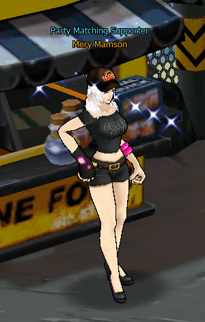
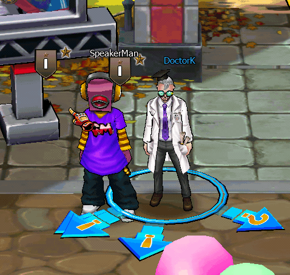

# 👯 Party System

### Overview

ระบบ **Party** ในเกม **Zone4** เป็นระบบที่ออกแบบมาเพื่อให้ผู้เล่นสามารถรวมทีมกันต่อสู้ในโหมด PvE และกิจกรรมต่าง ๆ ของเกม เช่น

* Hunting Ground
* Arcade Mode
* Mission Dungeon
* Event Content

Party system ทำให้ผู้เล่นสามารถ **เล่นแบบ Cooperative Combat** เพื่อเพิ่มประสิทธิภาพการต่อสู้ เก็บเลเวลเร็วขึ้น และผ่านด่านที่ยากขึ้นได้

การสร้าง Party จะต้องดำเนินการผ่าน **NPC เฉพาะในเมืองหลัก (Village / Zone 6)** ซึ่งทำหน้าที่เป็น Lobby สำหรับรวมทีมผู้เล่นก่อนเข้าสู่สนามต่อสู้

### **NPC List**

#### 1️⃣ **Angela Mamson ⭐**

<figure><figcaption></figcaption></figure>

#### 2️⃣ **Emma Mamson**

<figure><figcaption></figcaption></figure>

#### 3️⃣ **Mery Mamson**

<figure><figcaption></figcaption></figure>

NPC ทั้งสามตัวทำหน้าที่เหมือนกัน คือ

* สร้าง Party
* เข้าร่วม Party
* ค้นหา Party ที่เปิดอยู่

ผู้เล่นสามารถคุยกับ NPC ตัวใดก็ได้เพื่อจัดการ Party

### **How to create Party from NPC**



**Step 1 – Go to Village (Zone 6)**




**Step 2 – คุยกับ NPC Party**

เลือก NPC ใดก็ได้ เช่น

* Angela Mamson
* Emma Mamson
* Mery Mamson

<figure><figcaption></figcaption></figure>

NPC จะเปิดหน้าต่าง Party System



**Step 3 – เลือก Form Party**

<figure><figcaption></figcaption></figure>

ผู้เล่นจะสามารถ

* ตั้งชื่อ Party
* กำหนดประเภท Party

เช่น

* Public Party ( จะแสดงรายชื่อ Party บน Party Matching )
* Private Party ( จะไม่แสดงรายชื่อ Party บน Party Matching )



**Step 4 – Setting Party**

<figure><figcaption></figcaption></figure>

ผู้สร้าง Party สามารถกำหนด

* Party Name
* Party Type

หลังจากยืนยันแล้ว ผู้เล่นจะกลายเป็น **Party Leader**



**Step 5 – Confirm and Create Party**

หลังจากยืนยันแล้ว ผู้เล่นจะกลายเป็น **Party Leader**

<figure><figcaption></figcaption></figure>

<figure><figcaption></figcaption></figure>



### **How to create Party from User**



**Step 1 –** Right-Click On your Character

<figure><figcaption></figcaption></figure>

Select Form Party



**Step 2 – Setting Party**

<figure><figcaption></figcaption></figure>



**Step 3 – Confirm and Create Party**

หลังจากยืนยันแล้ว ผู้เล่นจะกลายเป็น **Party Leader**

<figure><figcaption></figcaption></figure>

<figure><figcaption></figcaption></figure>



### การเข้าร่วม Party

ผู้เล่นสามารถเข้าร่วม Party ได้ 2 วิธี

**1. Join Party จาก NPC**

คุยกับ NPC Party แล้วเลือก

**Join Party**

<figure><figcaption></figcaption></figure>

<figure><figcaption></figcaption></figure>

<figure><figcaption></figcaption></figure>

ระบบจะแสดง

* รายชื่อ Party ที่เปิดอยู่
* จำนวนสมาชิก
* Leader

ผู้เล่นสามารถเลือก Party ที่ต้องการเข้าร่วม 

**2. Invite จาก Leader**

<figure><figcaption></figcaption></figure>

Party Leader สามารถ

* Sent Party Invitation

<figure><figcaption></figcaption></figure>

เมื่อผู้เล่นกด Confirm จะเข้าร่วมทีมทันที

### **Leader Control**

Leader มีสิทธิ์

* Kick member
* Disband party
* Start mission

### **Item Distribution System**

<figure><figcaption></figcaption></figure>

> The Party Item Distribution System determines how loot dropped from monsters or missions is allocated among party members.\
> Party leaders can configure the distribution method before starting cooperative activities.

The system supports three distribution modes:

**Individual Distribution**\
Each player receives their own item drops independently, preventing competition over loot and ensuring fair distribution.

**In Order Distribution**\
Items are distributed sequentially among party members in a rotating order, guaranteeing equal opportunity for all players.

**Random Distribution**\
Loot is randomly assigned to a party member each time an item drops, adding an element of chance to item allocation.
