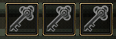

# Hunting Arcade

### Overview

**Hunting Arcade** เป็นโหมด **PvE (Player vs Environment)** ของเกม Zone4 ที่ให้ผู้เล่นเข้าไปต่อสู้กับศัตรูที่ควบคุมโดย AI ภายในพื้นที่ที่เรียกว่า **Hunting Land**

จุดประสงค์ของโหมดนี้คือ

* ฟาร์ม **EXP**
* ฟาร์ม **item**
* ฝึกการต่อสู้
* ทำ **story progression**

โหมดนี้จึงเป็นส่วนสำคัญของระบบ **PvE progression** ของเกม

<figure><figcaption></figcaption></figure>

<figure><figcaption></figcaption></figure>

## Hunting Land

เมื่อผู้เล่นเข้า **Hunting Land** จะสามารถเลือกพื้นที่ต่อสู้ได้

ตัวอย่างพื้นที่

| Area                 | Minimum Level |
| -------------------- | ------------- |
| BY-X Training Ground | Lv1           |
| BY-X Center          | Lv10          |
| Outlaw Fighting Zone | Lv15          |
| BY-X Safe House      | Lv20          |
| Mon-Exit Station     | Lv25          |

แต่ละพื้นที่มี

* ระดับเลเวลขั้นต่ำ
* ความยากของศัตรู
* reward ต่างกัน

## Hunting Arcade Gameplay Mechanics

<figure><figcaption></figcaption></figure>

## 1. Play-time System

ะบบ **Play Time** เป็นกลไกที่ใช้ควบคุมระยะเวลาการเล่นของผู้เล่นภายในโหมด **Hunting Arcade**

เมื่อผู้เล่นเข้าสู่ Hunting Arcade ระบบจะเริ่มจับเวลา **หนึ่งรอบการเล่น (Run)** ซึ่งมีระยะเวลาสูงสุด **30 นาที**

ภายในช่วงเวลานี้ผู้เล่นต้อง

* ต่อสู้กับศัตรู
* เคลียร์พื้นที่
* กำจัด **Boss ของแผนที่**

***

## 2. Play Session Structure

หนึ่งรอบของ Hunting Arcade มีโครงสร้างดังนี้

```
Enter Hunting Arcade
        ↓
Timer Start (30:00)
        ↓
Fight Enemies
        ↓
Boss Spawn
        ↓
Kill Boss (1/1)
        ↓
Exit Instance
```

ผู้เล่นจะถูกพาออกจาก Hunting Arcade เมื่อเกิดเงื่อนไขใดเงื่อนไขหนึ่งต่อไปนี้

***

## 3. Time Limit Condition

เงื่อนไขแรกคือ **หมดเวลา**

เมื่อผู้เล่นเข้า Hunting Arcade ระบบจะเริ่มนับเวลาถอยหลัง

```
30:00 → 00:00
```

ถ้าเวลาถึง **00:00**

ระบบจะ

* จบ session
* พาผู้เล่นออกจาก instance
* กลับไปยัง lobby / town

จุดประสงค์ของระบบนี้คือ

* ป้องกันการฟาร์มแบบไม่จำกัด
* ควบคุม economy ของเกม
* สร้าง session gameplay

***

## 4. Key Collection Objective

<figure><figcaption></figcaption></figure>

จาก UI ในเกม (ไอคอนกุญแจ 3 ดอก) หมายถึง

<figure><figcaption></figcaption></figure>

```
Key Collected : 0 / 3
```

ผู้เล่นต้อง

* กำจัด monster
* หา key drop
* สะสมให้ครบ **3 keys**

เมื่อเก็บครบ

<figure><figcaption></figcaption></figure>

```
Key Collected : 3 / 3
```

Boss Gate จะถูกปลดล็อก

***

## 5. Boss Kill Condition

<figure><figcaption></figcaption></figure>

เงื่อนไขที่สองคือ **กำจัด Boss สำเร็จ**

จาก UI ในเกมจะเห็นข้อความ

```
BOSS KILL 0 / 1
```

หมายความว่า

* แผนที่นั้นมี **Boss 1 ตัว**
* ผู้เล่นต้องกำจัด Boss ให้สำเร็จ

เมื่อผู้เล่นทำสำเร็จ

```
BOSS KILL 1 / 1
```

ระบบจะ

* ถือว่าภารกิจสำเร็จ
* จบ session ทันที
* พาผู้เล่นออกจาก Hunting Arcade

แม้ว่าเวลาจะยังเหลืออยู่ก็ตาม

***

## 6. Session End Conditions

สรุปเงื่อนไขการจบ session

| Condition       | Result                    |
| --------------- | ------------------------- |
| Time = 0        | Forced Exit               |
| Boss Kill = 1/1 | Mission Clear Forced Exit |

