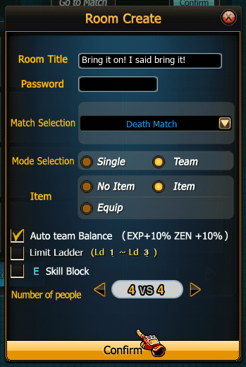

# Death Match

### Overview

**Death Match** เป็นโหมด PvP หลักของ Zone4 ที่ผู้เล่นจะต่อสู้กันในสนามเพื่อทำคะแนนจากการกำจัดคู่ต่อสู้

โหมดนี้แบ่งออกเป็น **2 ประเภท**

1. **Team Death Match**
2. **Single Death Match**

ทั้งสองโหมดมีลักษณะร่วมกันคือ

* รองรับผู้เล่น **1 – 8 คน**
* เริ่มเกมได้ที่ **ขั้นต่ำ 1 vs 1**
* มีตัวเลือกเวลา **3 นาที หรือ 5 นาที**
* มีระบบ **MVP (Most Valuable Player)** เพื่อวัด performance ของผู้เล่น

ในโหมด **Death Match** ของ Zone4 ผู้สร้างห้อง (Room Host) สามารถกำหนด **Gameplay Rules** เพิ่มเติมก่อนเริ่มแมตช์ได้ เพื่อควบคุมรูปแบบการเล่นของห้อง

ตัวเลือกสำคัญที่สามารถกำหนดได้คือ

1. **E Special Toggle**
2. **Item Usage Toggle**

## 1. Room Setting – E Special Toggle

Host สามารถเลือก

<div data-with-frame="true"><figure><figcaption></figcaption></figure></div>

| Option | Description                    |
| ------ | ------------------------------ |
| ON     | ผู้เล่นสามารถใช้ E Special ได้ |
| OFF    | ปิดการใช้ E Special ในแมตช์    |

### Gameplay Impact

เมื่อเปิด E Special

* ผู้เล่นสามารถใช้ท่าพิเศษ
* การต่อสู้มีความหลากหลาย
* มี burst damage สูง

เหมาะสำหรับ

* Casual PvP
* Full combat mode

***

#### เมื่อปิด E Special

* ผู้เล่นใช้ได้เฉพาะ **normal combo**
* เน้น skill และ timing
* ลด burst damage

เหมาะสำหรับ

* Competitive PvP
* Skill-based matches

***

### Item Usage System

ในบางแมตช์ PvP ผู้เล่นสามารถใช้งาน **Special Items** ระหว่างการต่อสู้ได้

Item เหล่านี้อาจให้

* Buff
* Heal
* Utility effect

## 2. Team Death Match

### 2.1 Overview

Team Death Match เป็นโหมดที่ผู้เล่นถูกแบ่งออกเป็นสองทีม

<div data-with-frame="true"><figure><figcaption></figcaption></figure></div>

```
Red Team
Blue Team
```

ผู้เล่นในแต่ละทีมสามารถมีได้สูงสุด **4 คน**

ดังนั้นจำนวนผู้เล่นรวมสูงสุดในห้องคือ

```
8 Players (4 vs 4)
```

ขั้นต่ำในการเริ่มเกมคือ

```
1 vs 1
```

***

## 2.2 Match Duration

ผู้สร้างห้องสามารถเลือกเวลาแข่งขันได้

| Match Time | Description   |
| ---------- | ------------- |
| 3 Minutes  | Match สั้น    |
| 5 Minutes  | Match มาตรฐาน |

เมื่อเวลา

```
Timer = 0
```

ระบบจะคำนวณคะแนนเพื่อหาผู้ชนะ

***

## 2.3 Scoring System

คะแนนทีมจะเพิ่มเมื่อกำจัดผู้เล่นฝ่ายตรงข้าม

```
Enemy Kill = +1 Team Point
```

ตัวอย่าง Scoreboard

<div data-with-frame="true"><figure><figcaption></figcaption></figure></div>

| Team      | Score |
| --------- | ----- |
| Red Team  | 21    |
| Blue Team | 11    |

ทีมที่มีคะแนนสูงสุดเมื่อเวลาหมดจะเป็นผู้ชนะ

***

## 2.4 Tie-Break Rule

กรณีคะแนนเท่ากัน

ตัวอย่าง

```
Red Team = 35
Blue Team = 35
```

ระบบจะใช้ **MVP Player** เป็นตัวตัดสิน

กติกา

```
ทีมที่ผู้เล่น MVP อยู่ → ทีมนั้นชนะ
```

ตัวอย่าง

| MVP Player | Team     |
| ---------- | -------- |
| Player A   | Red Team |

ผลลัพธ์

```
Red Team Win
```

***

## 3. Single Death Match

### 3.1 Overview

Single Death Match เป็นโหมด **Free For All PvP**

ผู้เล่นทุกคนจะต่อสู้กันเอง ไม่มีทีม

จำนวนผู้เล่น

```
1 – 8 Players
```

ขั้นต่ำเริ่มเกม

```
1 vs 1
```

***

## 3.2 Match Duration

เหมือนกับ Team Death Match

| Match Time | Description    |
| ---------- | -------------- |
| 3 Minutes  | Short Match    |
| 5 Minutes  | Standard Match |

***

## 3.3 Scoring System

ผู้เล่นจะได้รับคะแนนเมื่อกำจัดผู้เล่นคนอื่น

```
Player Kill = +1 Point
```

ตัวอย่าง scoreboard

| Rank | Player   | Score |
| ---- | -------- | ----- |
| 1    | Player A | 35    |
| 2    | Player B | 33    |
| 3    | Player C | 21    |

ผู้เล่นที่มีคะแนนสูงสุดเมื่อเวลาหมดจะชนะ

***

## 3.4 Tie-Break Rule

หากผู้เล่นอันดับ 1 และ 2 มีคะแนนเท่ากัน

ตัวอย่าง

```
Rank 1 = 35
Rank 2 = 35
```

ระบบจะใช้ **MVP Player** เป็นตัวตัดสิน

กติกา

```
ผู้เล่นที่ได้รับ MVP → ชนะทันที
```

ตัวอย่าง

| Player   | Score | MVP |
| -------- | ----- | --- |
| Player A | 35    | ✓   |
| Player B | 35    | -   |

ผลลัพธ์

```
Player A Win
```

***

## 4. MVP System

### 4.1 Overview

MVP (Most Valuable Player) เป็นระบบที่ใช้ประเมิน **ผู้เล่นที่มีผลงานดีที่สุดในแมตช์**

MVP ไม่ได้วัดจาก kill เพียงอย่างเดียว

แต่คำนวณจากหลายองค์ประกอบ

***

### 4.2 MVP Calculation Factors

องค์ประกอบที่ใช้คำนวณ MVP เช่น

| Factor       | Description   |
| ------------ | ------------- |
| Damage Dealt | ดาเมจที่ทำได้ |
| Kill Count   | จำนวน kill    |

ระบบจะคำนวณ **Performance Score**

ผู้เล่นที่มีคะแนนสูงสุดจะได้รับ MVP

***

## 5. Gameplay Impact of MVP

MVP มีบทบาทสำคัญในระบบ

#### 1. Tie-break decision

ใช้ตัดสินผู้ชนะในกรณีคะแนนเท่ากัน

***

#### 2. Player Recognition

แสดงผู้เล่นที่มีผลงานดีที่สุด

***

#### 3. Performance Reward

บางระบบอาจให้

* EXP bonus
* Gold bonus
