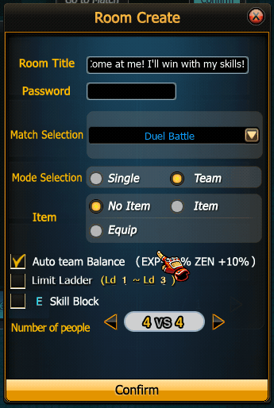

# Duel Mode

### Overview

**Duel Mode** หรือที่ผู้เล่นเรียกว่า **“ห้องแดง”** เป็นโหมด PvP แบบ **1 vs 1 ต่อเนื่อง** ที่ผู้เล่นหลายคนสามารถเข้ารอคิวเพื่อท้าประลองกับผู้ชนะในสนาม

ลักษณะสำคัญของโหมดนี้คือ

> ผู้ชนะจะอยู่ในสนามต่อไป ส่วนผู้แพ้จะถูกแทนที่โดยผู้เล่นคนถัดไป

จึงเป็นโหมดที่เน้น

* การดวลตัวต่อตัว
* การวัด skill ระหว่างผู้เล่น
* การรักษา **Win Streak**

***

## 2. Room Structure

ห้อง Duel Mode รองรับผู้เล่นหลายคนในห้องเดียว แต่ **ในสนามจะมีผู้เล่นต่อสู้เพียง 2 คน**

โครงสร้างห้อง

```
Active Fighters
Player A vs Player B

Waiting Queue
Player C
Player D
Player E
```

ผู้เล่นที่ไม่ได้อยู่ในสนามจะอยู่ใน **คิวรอ (Queue)**

***

## 3. Match Flow

ลำดับการเล่นใน Duel Mode

```
Match Start
      ↓
Player A vs Player B
      ↓
Winner stays in arena
      ↓
Loser leaves arena
      ↓
Next player from queue enters
      ↓
New duel begins
```

ผู้เล่นที่ชนะจะยังคงอยู่ในสนาม

***

## 4. Challenger System

ผู้เล่นที่รอคิวจะถูกเลือกเข้ามาท้าดวลกับผู้ชนะ

```
Queue System
First player in queue → Next challenger
```

ทำให้เกิดระบบ

> **King of the Hill PvP**

ผู้เล่นที่เก่งที่สุดจะสามารถอยู่ในสนามได้นานที่สุด

***

## 5. Win Streak System

Duel Mode มักใช้ระบบ **Win Streak**

ตัวอย่าง

| Player   | Win Streak |
| -------- | ---------- |
| Player A | 3 Wins     |
| Player B | 1 Wins     |

ผู้เล่นที่สามารถชนะต่อเนื่องจะสร้างสถิติ

```
Winning Streak
```

ซึ่งเป็นความท้าทายหลักของโหมดนี้

***

## 6. Match Duration

Duel Match

* มี timer 100 วิ/รอบ

โดยการดวลจะจบเมื่อ

```
Player HP = 0
```

ผู้แพ้จะถูกนำออกจากสนามทันที

***

## 7. Spectator System

ผู้เล่นที่รอคิวสามารถ

* ดูการต่อสู้
* รอคิวเข้าสนาม

ทำให้ Duel Mode เป็นเหมือน

> PvP Arena

ที่ผู้เล่นรวมตัวกันเพื่อดูและท้าดวลกัน

***

## 8. Gameplay Rules

Duel Mode ใช้ระบบ combat เดียวกับ PvP ปกติ

ประกอบด้วย

* Combo system
* Grab mechanics
* Special skill
* Counter timing

แต่เนื่องจากเป็น **1v1** จึงเน้น

* Reaction
* Mind game
* Combo execution

***

## 9. Room Customization

ผู้สร้างห้องสามารถตั้งค่า

<figure><figcaption></figcaption></figure>

| Setting   | Option   |
| --------- | -------- |
| E Special | ON / OFF |

เพื่อกำหนดรูปแบบการต่อสู้
