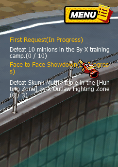
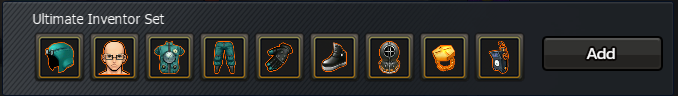

# 📚 Collection System

## Overview

**Collection System** เป็นระบบสะสมไอเท็ม (Item Collection System) ที่เปิดโอกาสให้ผู้เล่นนำไอเท็มในเกมมาลงทะเบียนใน **Collection Book** เพื่อปลดล็อค **Collection Achievement และ Stat Reward**

ระบบนี้มีวัตถุประสงค์เพื่อ

* เพิ่ม **Long-term progression**
* กระตุ้นการ **สะสมไอเท็ม**
* สร้าง **Item Sink** เพื่อลดปริมาณไอเท็มในเศรษฐกิจเกม
* เพิ่ม **Character Stat Bonus**

<figure><figcaption></figcaption></figure>

## Collection Category

Collection Book แบ่งหมวดหมู่การสะสมออกเป็นหลายประเภท

| Category  | Description         |
| --------- | ------------------- |
| Costume   | ชุดและไอเท็มแต่งตัว |
| Character | ไอเท็มตัวละคร       |
| PVE       | ไอเท็มจาก PVE       |
| PVP       | ไอเท็มจาก PVP       |
| Event     | ไอเท็มกิจกรรม       |
| Secret    | คอลเลคชั่นพิเศษ     |

ผู้เล่นสามารถตรวจสอบความคืบหน้าการสะสมได้จาก **Collection Achievement Panel**

## Collection Registration

ผู้เล่นสามารถลงทะเบียนไอเท็มใน Collection Book โดย

<figure><figcaption></figcaption></figure>

เลือก Collection Set

<figure><figcaption></figcaption></figure>

เลือกไอเท็มที่ต้องการ Register

<figure><figcaption></figcaption></figure>

ยืนยันการลงทะเบียน

⚠️ ไอเท็มที่ลงทะเบียนแล้วจะ

**ถูกทำลาย (Item Destroyed)**

## Collection Set System

ในบาง  Collection จะประกอบด้วย **Item Set**

<figure><figcaption></figcaption></figure>

ตัวอย่างเช่น

* Ultimate Inventor Set

ผู้เล่นต้องสะสม **ไอเท็มครบชุด** เพื่อปลดล็อค Reward

## Reward System

เมื่อผู้เล่นสะสมไอเท็มครบตามเงื่อนไข

<figure><figcaption></figcaption></figure>

ระบบจะปลดล็อค **Collection Reward**

<figure><figcaption></figcaption></figure>

ตัวอย่างรางวัล

| Reward Type    | Example |
| -------------- | ------- |
| Character Stat | HP +1   |

ผู้เล่นสามารถกด **Claim Reward** เพื่อรับโบนัส

<figure><figcaption></figcaption></figure>

## Stat Categories

Collection Stat จะเพิ่มค่าสถานะให้กับตัวละครในหลายด้าน

### Attack Stats

เพิ่มประสิทธิภาพการโจมตี

| Stat    | Description               |
| ------- | ------------------------- |
| Hit     | ความแม่นยำของการโจมตี     |
| Grip    | พลังจับ / ควบคุมคู่ต่อสู้ |
| Team    | โบนัสในการต่อสู้แบบทีม    |
| Double  | ความสามารถโจมตีต่อเนื่อง  |
| Special | พลังโจมตีท่าพิเศษ         |

***

### Defense Stats

เพิ่มความสามารถในการป้องกัน

| Stat    | Description                  |
| ------- | ---------------------------- |
| Hit     | ลดโอกาสโดนโจมตี              |
| Grip    | ลดโอกาสโดนจับ                |
| Team    | เพิ่มการป้องกันใน Team Fight |
| Double  | ลดความเสียหายจาก Combo       |
| Special | ต้านทานท่าพิเศษ              |

***

### Core Character Stats

| Stat         | Description        |
| ------------ | ------------------ |
| HP           | เพิ่มพลังชีวิต     |
| SP           | เพิ่มพลังสกิล      |
| Critical     | โอกาสโจมตีคริติคอล |
| Critical DMG | ความแรงคริติคอล    |

