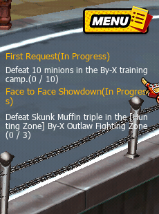

# 🛠️ Craft System

## Overview

**Craft System** เป็นระบบสร้างไอเท็ม (Item Crafting System) ที่เปิดโอกาสให้ผู้เล่นนำ **วัสดุ (Materials) และสกุลเงินในเกม** มาผสมเพื่อสร้าง **Costume หรือ Equipment ใหม่**

ระบบนี้ช่วยเพิ่ม

* **Item Progression**
* **Resource Sink**
* **Player Customization**

และเป็นหนึ่งในกลไกหลักของเศรษฐกิจไอเท็มในเกม

***

## Crafting Categories

<figure><figcaption></figcaption></figure>

ระบบ Craft ถูกแบ่งออกเป็นหมวดหมู่ของไอเท็ม

<figure><figcaption></figcaption></figure>

| Category   | Description                               |
| ---------- | ----------------------------------------- |
| Costume    | ชุดแฟชั่น / เครื่องแต่งกาย                |
| DE Costume | ชุดพิเศษที่เกี่ยวข้องกับ Premium Currency |
| Stuff      | อุปกรณ์หรือไอเท็มทั่วไป                   |
| ETC        | ไอเท็มอื่น ๆ                              |

ผู้เล่นสามารถเลือกหมวดหมู่และดูรายการไอเท็มที่สามารถสร้างได้

## Crafting Process

ขั้นตอนการ Craft

### Step 1: Player Selects Item

ผู้เล่นเปิดเมนู **Crafting** และเลือกไอเท็มที่ต้องการสร้างจากรายการ Recipe

<figure><figcaption></figcaption></figure>

ตัวอย่าง

* Hapkido Suit

ระบบจะโหลดข้อมูล **Recipe ของไอเท็มนั้น**

***

### Step 2: System Loads Recipe Data

ระบบดึงข้อมูลสูตรจากฐานข้อมูล เช่น

<figure><figcaption></figcaption></figure>

* Required Materials
* Required Currency
* Success Rate
* Destroy Rate

## Success & Failure System

Crafting ใน Zone4 มีระบบ **Probability-based Crafting**

<figure><figcaption></figcaption></figure>

ตัวอย่าง

| Result  | Rate |
| ------- | ---- |
| Success | 90%  |
| Destroy | 10%  |

หาก Craft ล้มเหลว

* วัตถุดิบบางส่วนหรือทั้งหมดจะถูกทำลาย

***

## Blessing System

ผู้เล่นสามารถใช้ไอเท็มพิเศษ เช่น

```
Zeed Blessing
```

เพื่อช่วยในกระบวนการ Craft

***

## Item Creation Output

เมื่อ Craft สำเร็จ

<figure><figcaption></figcaption></figure>

ผู้เล่นจะได้รับไอเท็ม เช่น

* Hapkido Suit

ไอเท็มจะถูกเพิ่มเข้า Inventory ของผู้เล่นทันที
