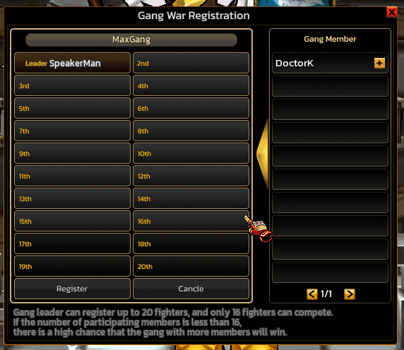
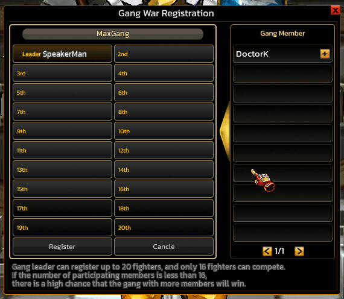
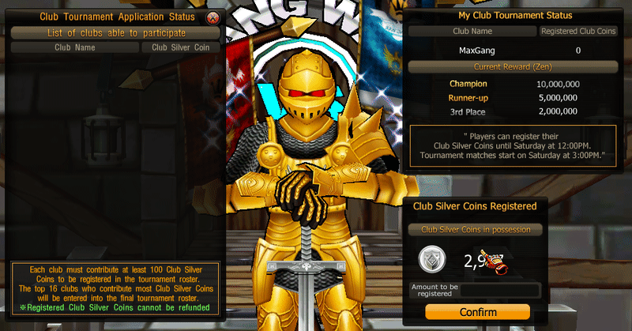

# Gang War Resgisteration

## 1. Executive Summary

ระบบ **Gang War Registration** เป็นกลไกการแข่งขันแบบทีม (Clan/Gang PvP) ในเกม Zone4 ที่ออกแบบมาเพื่อให้ผู้เล่นรวมตัวกันเป็น Gang และเข้าร่วมการแข่งขันในรูปแบบ **Team Tournament**

วัตถุประสงค์ของระบบนี้คือ

* ส่งเสริม **Community Gameplay**
* เพิ่ม **Competitive PvP Content**
* สร้าง **เศรษฐกิจในเกมผ่าน Coin Contribution**
* กระตุ้นให้เกิด **การรวมตัวของผู้เล่นใน Gang**

Gang ที่ต้องการเข้าร่วมจะต้องทำการ

1. ลงทะเบียนสมาชิกนักสู้
2. ลงทะเบียนเหรียญ Club Silver Coin
3. ผ่านเงื่อนไขขั้นต่ำก่อนการแข่งขัน

ระบบจะคัดเลือก **16 Gang ที่มี Contribution สูงสุด** เพื่อเข้าสู่การแข่งขันรอบ Tournament

## Gang Fighter Registration System

Registration Rules

| Parameter                        | Value       |
| -------------------------------- | ----------- |
| จำนวนสมาชิกสูงสุดที่ลงทะเบียนได้ | 20 คน       |
| จำนวนผู้เข้าแข่งขันจริง          | 16 คน       |
| ผู้ลงทะเบียน                     | Gang Leader |

### Registration Flow

ขั้นตอนการลงทะเบียน

1️⃣ Gang Leader เปิดเมนู

<figure><figcaption></figcaption></figure>

```
Gang War Registration
```

2️⃣ เลือกสมาชิกจาก

<figure><figcaption></figcaption></figure>

```
Gang Member List
```

3️⃣ กดปุ่ม

```
[+]
```

เพื่อเพิ่มสมาชิกเข้าทีม

4️⃣ สมาชิกจะถูกจัดลำดับตำแหน่ง

```
Leader
2nd
3rd
...
20th
```

5️⃣ กด ปุ่ม Register เพื่อยืนยัน โดยจะใช้ Zen จำนวน 1,000,000 Zen ในการ Register

<figure><figcaption></figcaption></figure>

```
Register
```

## Club Silver Coin Contribution System

### Objective

ใช้เหรียญ **Club Silver Coin** เป็นตัวกำหนดสิทธิ์เข้าร่วม Tournament

***

### Registration Rules

| Parameter            | Value           |
| -------------------- | --------------- |
| Minimum Contribution | 100 Coins       |
| Refund               | ไม่สามารถคืนได้ |
| Ranking              | ใช้จำนวน Coin   |

***

### 4.3 Contribution Flow


1️⃣ เปิดเมนู

<figure><figcaption></figcaption></figure>

```
Club Tournament Status
```

2️⃣ ใส่จำนวนเหรียญ

<figure><figcaption></figcaption></figure>

```
Amount to be registered
```

3️⃣ กด

```
Confirm
```

4️⃣ ระบบเพิ่มเหรียญให้ Gang

***

### 4.4 Selection Mechanism

ระบบจะจัดอันดับ Gang

ตามจำนวน

```
Club Silver Coins Registered
```

แล้วเลือก

```
Top 16 Gangs
```

เข้าสู่การแข่งขัน

## Base Reward

| Rank      | Reward          |
| --------- | --------------- |
| Champion  | 10,000,000 Zen+ |
| Runner-up | 5,000,000 Zen+  |
| 3rd Place | 2,000,000 Zen+  |

