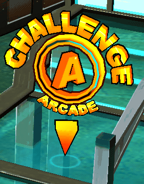
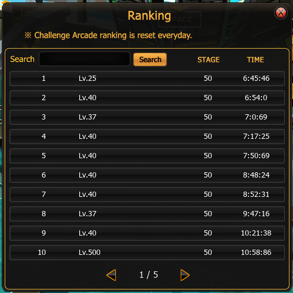

# 1-50 Challenge Arcade

**Challenge Arcade** เป็น **โหมด PvE แบบ Solo Survival Progression** ที่ออกแบบมาเพื่อทดสอบความสามารถของผู้เล่นผ่านด่านต่อเนื่องจำนวน **50 Stage** โดยมีระบบ **Difficulty Scaling**, **Limited Life**, และ **Reward Scaling** เพื่อสร้างความท้าทายและแรงจูงใจในการแข่งขันผ่าน **Daily Ranking System**

ผู้เล่นต้องต่อสู้กับ **NPC Fighters** ที่มีความยากเพิ่มขึ้นเรื่อย ๆ จนถึง Stage 50 ซึ่งเป็นระดับสูงสุดของระบบ

## Entry System

<figure><figcaption></figcaption></figure>

### Entry Condition

ผู้เล่นสามารถเข้าเล่น Challenge Arcade ได้หลายครั้งต่อวัน

| Entry Count | Entry Fee |
| ----------- | --------- |
| 1 – 2       | Free      |
| 3           | 1000 Zen  |
| 4           | 2000 Zen  |
| 5           | 3000 Zen  |

ค่าเข้าเพิ่มขึ้นทุกครั้งที่เล่นเพิ่มในวันเดียวกัน

***

## Core Combat System

### Player Objective

เอาชนะ NPC fighters เพื่อผ่านด่านให้ได้มากที่สุด

***

### Enemy Structure

Enemy ถูกออกแบบให้มีลักษณะดังนี้

| Attribute   | Description                                   |
| ----------- | --------------------------------------------- |
| Class       | Martial Art Class (Muay Thai, Taekwondo etc.) |
| Skill Set   | Combo Skill + Special Skill                   |
| AI Behavior | Aggressive / Defensive                        |
| Scaling     | Damage + HP Increase                          |

### Healing System

ไม่มีระบบฟื้น HP ระหว่าง Stage

```
No Healing Item
No HP Pickup
No Recovery Box
```

***

## Difficulty Scaling

Difficulty เพิ่มขึ้นตาม Stage

#### Scaling Parameters

| Parameter     | Scaling                 |
| ------------- | ----------------------- |
| Enemy HP      | Increase per stage      |
| Enemy Damage  | Increase per stage      |
| Enemy Count   | Increase after stage 30 |
| AI Aggression | Increase late stages    |

***

### Difficulty Phases

| Stage | Difficulty Tier |
| ----- | --------------- |
| 1–10  | Tutorial PvE    |
| 11–20 | Normal          |
| 21–30 | Advanced        |
| 31–40 | Expert          |
| 41–50 | Extreme         |

***

## Ranking System


Challenge Arcade ใช้ระบบ **Daily Ranking**

<figure><figcaption></figcaption></figure>

Ranking คำนวณจาก

```
Ranking Score = Stage Cleared + Clear Time
```

Ranking reset ทุกวัน

***

## Reward System

Reward ขึ้นอยู่กับ **Stage ที่ไปถึง**

<figure><figcaption></figcaption></figure>

### Reward Chest Distribution

| Stage | Reward Chest |
| ----- | ------------ |
| 1–10  | 0            |
| 11–20 | 1            |
| 21–30 | 2            |
| 31–40 | 3            |
| 41–43 | 4            |
| 44–46 | 5            |
| 47–49 | 6            |
| 50    | 8            |

Stage 50 ให้รางวัลสูงสุด 8 กล่อง
